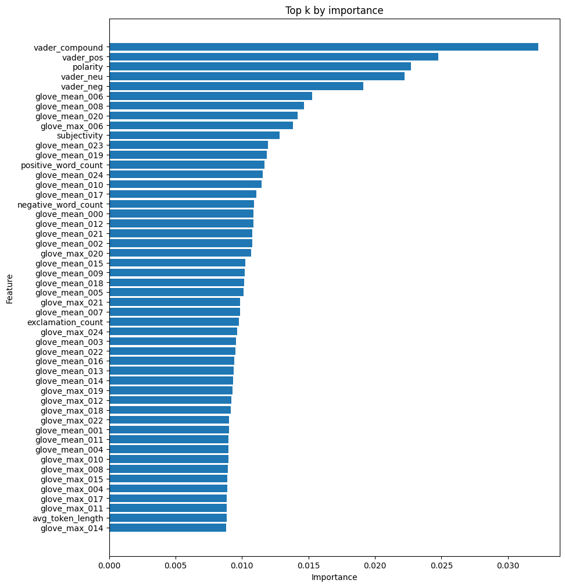
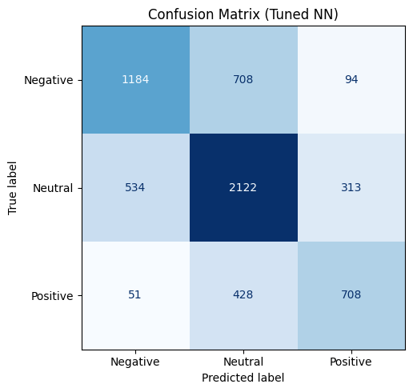

# Team 2 Group Project Report

## Team Members
- Νεόφυτος Ιωάννου
- Αντρέας Λαός Ξ.
- Γιώργος Παφίτης

## Project Overview
The project focuses on multiclass sentiment classification of tweets from Twitter. We developed a system that
classifies tweets as Positive, Negative or Neutral. To achieve this, we implement multiple custom features relevant to the task,
perform feature selection using a Random Forest classifier to identify the most useful features, and train a neural classifier, using Optuna to optimize its hyperparameters.

## Preprocessing Pipeline
Each tweet is passed through the appropriate preprocessing steps needed for each feature extraction method:
1. **Uncontracting**: expands contractions (e.g. *don't* → *do not*) to preserve negation signals.
2. **Tokenization**: uses the ekphrasis social tokenizer, which handles tokens like hashtags, mentions, and emoticons.
3. **Lowercasing**: normalizes token casing.
4. **Stopword removal**: removes common English stopwords using NLTK.
5. **Lemmatization**: reduces words to their base form using WordNet.

## Feature Types Used
### Lexical Features
- TF-IDF Features: Top 1000 unigrams and bigrams. Important words and phrases may be strongly associated with positive or negative sentiment
- Average Token Length: Use of longer words may reflect stronger emotions.
- Number of Elongated Words: Elongated words (e.g. soooo) could indicate emphasis.

### Syntactic Features
- Number POS Tags: Count of each POS tags which can distinguish sentences carrying emotion. 

### Semantic Features
- TextBlob Polarity Score: Direct estimate of tweet's polarity.
- TextBlob Subjectivity Score: Higher subjectivity indicates feelings and opinions, while objective tweets reflect a neutral sentiment.
- VADER Sentiment Scores: Fine-grained polarity scores tailored for social media posts
- Count Of Positive and Negative Emoticons: Captures sentiment carried from emoticons
- Number of Positive Words: Direct correlation with positive sentiment
- Number of Negative Words: Direct correlation with negative sentiment
- GloVe embeddings: Global word co-ocurrence statistics, capturing scemantic similarity between tokens

### Structural Features
- Log of Number of Tokens: Longer tweets may correlate with negative emotions.
- Number of Exclamation Marks: Shows emotional intensity.
- Number of Hashtag Marks: Number of exclamation marks (#)
- Number of Questions: Questions reflect uncertainty which could indicate negative emotions.

### Behavioural Features
- Number of Mentions: Counts how many users are mentioned in a tweet, which could carry targeted emotions.
- Contains URL (Boolean): If tweet contains a token starting with http:// or https://
- Number of Happy Emoticons: Directly signal positive emotions
- Number of Sad Emoticons: Directly signal negative emotions
- Count of Negation Words: Negation words flip the polarity of sentences.
- Ratio of Negation Words: High negation ratio leads to ambiguity in polarity detection.
- Count of Profanity Words: Profanity often correlates with strong negative emotions

## Model Implemented
The geral achitecture used is an MLP. 

We ran optuna for 75 iterations to find the best model hyperparameters:

| Hyperparameter  | Value                  |
|-----------------|------------------------|
| n_layers        | 3                      |
| units           | 64                     |
| activation      | gelu                   |
| dropout_rate    | 0.2                    |
| optimizer       | adam                   |
| learning_rate   | 0.0006123962416241381  |
| batch_size      | 32                     |

## Feature Importance
We selected the top 50 features as input to our model through training a Random Forrest clasifier.

### Interpretation
Vader and polarity are as expected the most important features, as they were trained specifically on social media posts (including twitter). 
Important to node, a large amount of the selected features are GloVe embeddings, these were also expected as they were trained on tweets. 
## Key Results & Findings

| Class        | Precision | Recall | F1-Score | Support |
|--------------|-----------|--------|----------|---------|
| 0            | 0.67      | 0.60   | 0.63     | 1986    |
| 1            | 0.65      | 0.71   | 0.68     | 2969    |
| 2            | 0.63      | 0.60   | 0.62     | 1187    |
| accuracy     |           |        | 0.65     | 6142    |
| macro avg    | 0.65      | 0.64   | 0.64     | 6142    |
| weighted avg | 0.65      | 0.65   | 0.65     | 6142    |

### Class-level analysis

The model achieves 65% accuracy overall, which is reasonable for Twitter sentiment.

Neutral tweets are predicted best (F1=0.68), largely because they dominate the dataset (~48% of samples). Recall is highest here at 0.71, which suggests the model plays it safe on uncertain tweets and defaults to Neutral, dragging down recall for the other two classes.
Negative tweets are caught with the highest precision of any class (0.67) when predicted, but the model misses 40% of them (recall 0.60), yielding an F1 of 0.63.

Positive tweets are the weakest point: fewest training examples (~19% of samples) and the lowest F1 (0.62), with both precision (0.63) and recall (0.60) underperforming. They are the hardest to distinguish from Neutral.

In short, the model is conservative, it handles the majority class well but struggles to pick up on subtle positive or negative signals in noisy tweet text.